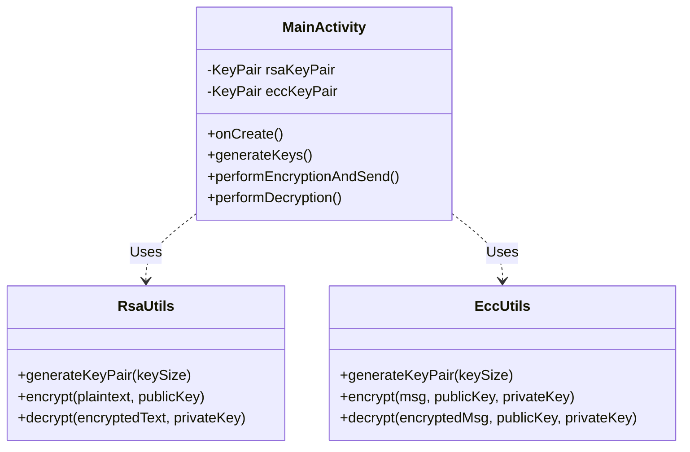
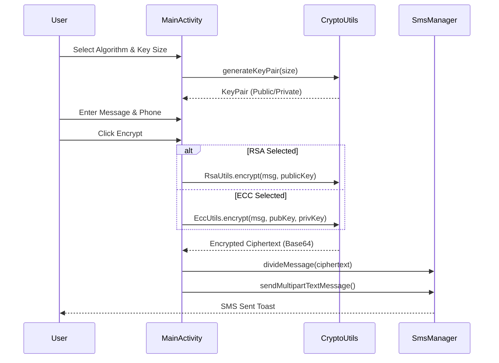
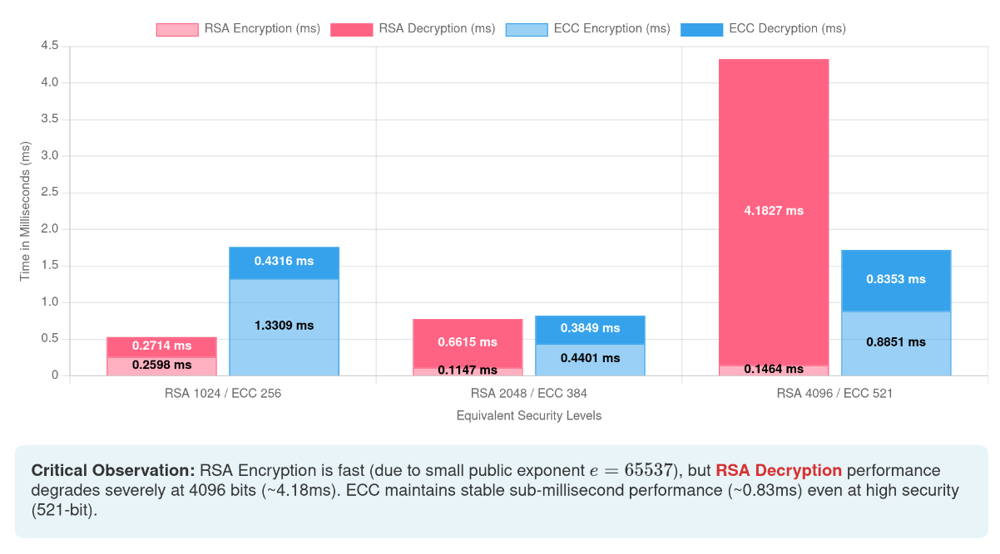
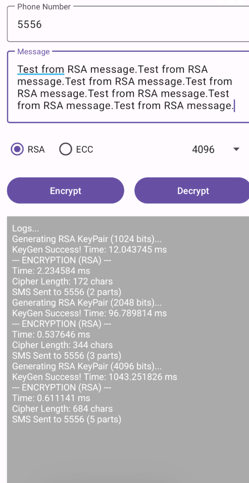
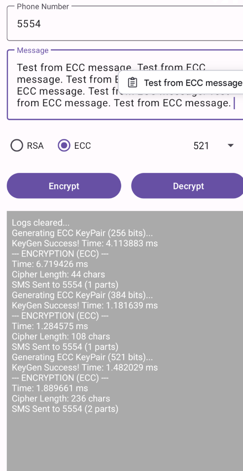

# SecureMessagingApp

## Overview

SecureMessagingApp is an Android application designed to demonstrate and compare the performance and security of two major cryptographic algorithms: **RSA (Rivest–Shamir–Adleman)** and **ECC (Elliptic Curve Cryptography)**.

The app allows users to encrypt and decrypt text messages using either algorithm with varying key sizes, providing real-time performance metrics (encryption/decryption time) to highlight the efficiency differences between the two approaches. It also supports sending the encrypted payloads via SMS.

## Features

- **Dual Algorithm Support**: Choose between RSA and ECC for encryption operations.
- **Variable Key Sizes**:
  - **RSA**: 1024, 2048, 4096 bits.
  - **ECC**: 256, 384, 521 bits (Standard curves: secp256r1, secp384r1, secp521r1).
- **Performance Metrics**: Real-time logging of key generation, encryption, and decryption times in milliseconds.
- **SMS Integration**: Automatically splits and sends encrypted messages via SMS (handling multipart messages for long ciphertexts).
- **Hybrid Encryption (ECC)**: Implements ECDH (Elliptic Curve Diffie-Hellman) for key agreement combined with AES for efficient message encryption.

## Architecture

### Class Structure



### Encryption Flow



## Performance Analysis

The application includes a detailed performance comparison between RSA and ECC.

**Key Observations:**

- **Encryption**: RSA encryption is generally very fast due to the small public exponent ($e=65537$).
- **Decryption**: RSA decryption is significantly slower, especially at higher key sizes (e.g., 4096 bits), as it involves complex modular exponentiation with a large private exponent.
- **ECC Stability**: ECC maintains stable, sub-millisecond performance for both encryption and decryption even at high security levels (e.g., 521 bits), making it superior for mobile devices with limited processing power.



## Screenshots

|              RSA Encryption              |              ECC Encryption              |
| :--------------------------------------: | :--------------------------------------: |
|  |  |

## Getting Started

1.  **Clone the repository**:
    ```bash
    git clone https://github.com/dontloseyourheadsu/SecureMessagingApp.git
    ```
2.  **Open in Android Studio**:
    - Select "Open an existing Android Studio project" and navigate to the cloned folder.
3.  **Build the project**:
    - Wait for Gradle sync to complete.
    - Run the app on an emulator or physical device.
4.  **Permissions**:
    - Grant SMS permissions when prompted to test the SMS sending feature.

## Requirements

- Android SDK 24+
- Kotlin 1.9+
- Gradle 8.0+
